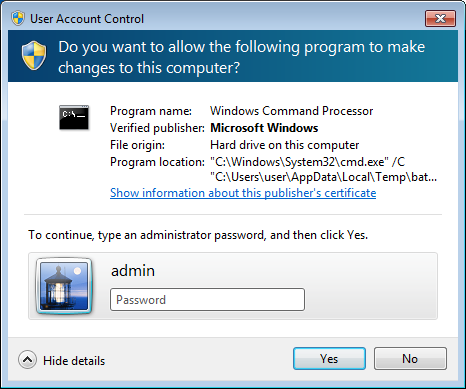
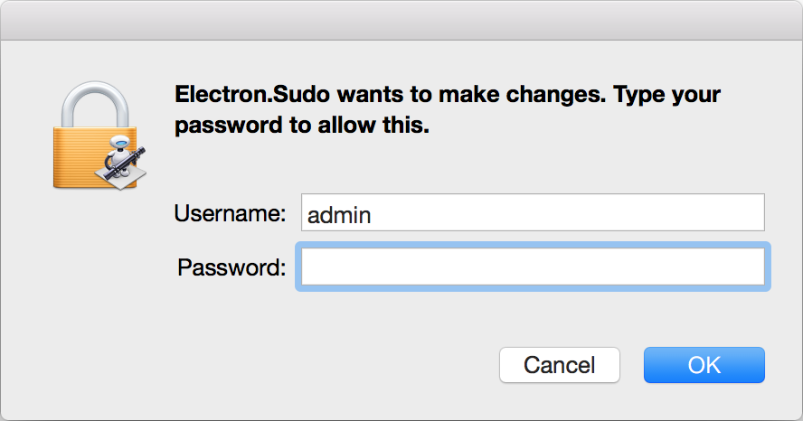
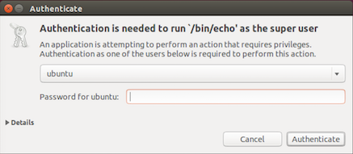
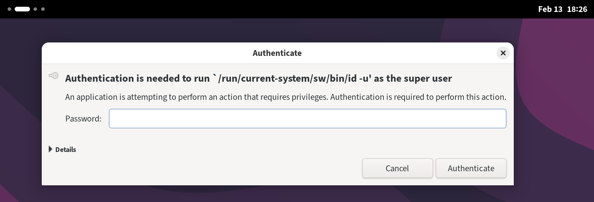

# electron-sudo-universal

> Fork of [automation-stack/electron-sudo](https://github.com/automation-stack/electron-sudo) with TypeScript support and NixOS compatibility.

## Key Differences from Original
- Full TypeScript rewrite with proper type definitions
- Native NixOS support with automatic detection and configuration
- Improved error handling with detailed error messages
- Better process cleanup and resource management
- Comprehensive test suite for all platforms
- Modern ES module exports
- Updated dependencies
- Stricter type checking for options and configurations
- Better handling of environment variables
- Improved documentation including NixOS setup

All original features are maintained while adding type safety and better platform support.

## Electron subprocess with administrative privileges

Run a subprocess with administrative privileges, prompting the user with a graphical OS dialog if necessary. Useful for background subprocesses which run native Electron apps that need sudo.

- `Windows`, uses [elevate utility](https://github.com/danielmain/electron-sudo-universal/tree/master/src/vendor/win32) with native `User Account Control (UAC)` prompt (no `PowerShell` required)
- `OS X`, uses bundled [applet](https://github.com/danielmain/electron-sudo-universal/tree/master/src/bin/applet.app) (inspired by [Joran Dirk Greef](https://github.com/jorangreef))
- `Linux`, uses system `pkexec` or [gksudo](http://www.nongnu.org/gksu) (system or bundled)
- `NixOS`, uses system `pkexec` with proper setuid wrapper support

If you don't trust binaries bundled in `npm` package you can manually build tools and use them instead.

   

## Features
- Supports `spawn` and `exec` subprocess behavior
- Supports applications packaged as `asar` archive
- Separate password prompt for each call (use `sh` or `bat` script for single prompt)
- No external dependencies, does not depend on OS versions
- Native NixOS support with automatic detection and configuration

## Installation
```bash
npm install electron-sudo
```

### NixOS Setup

If you're using NixOS, ensure polkit is enabled in your configuration:

```nix
{
  # Enable polkit (required for electron-sudo)
  security.polkit.enable = true;
  
  environment.systemPackages = with pkgs; [
    polkit
  ];
}
```

Then rebuild your system:
```bash
sudo nixos-rebuild switch
```

## Usage

**Note: Your command should not start with the `sudo` prefix.**

### Version 4.0.*

```javascript
import BaseSudoer from 'electron-sudo';

let options = {name: 'electron sudo application'},
    sudoer = new BaseSudoer(options);

/* Spawn subprocess behavior */
let cp = await sudoer.spawn(
  'echo', ['$PARAM'], {env: {PARAM: 'VALUE'}}
);
cp.on('close', () => {
  /*
    cp.output.stdout (Buffer)
    cp.output.stderr (Buffer)
  */
});

/* Exec subprocess behavior */
let result = await sudoer.exec(
  'echo $PARAM', {env: {PARAM: 'VALUE'}}
);
/* result is Buffer with mixed (both stdout and stderr) output */


/* Usage with Vanilla JS */
var BaseSudoer = require('electron-sudo').default;
var sudoer = new BaseSudoer(options);
sudoer.spawn('echo', ['$PARAM'], {env: {PARAM: 'VALUE'}}).then(function (cp) {
  /*
    cp.output.stdout (Buffer)
    cp.output.stderr (Buffer)
  */
});

```

### Version 3.0.* (deprecated)

```javascript
var sudo = require('electron-sudo');
var options = {
  name: 'Your application name',
  icns: '/path/to/icns/file', // (optional, only for MacOS),
  process: {
    options: {
      // Can use custom environment variables for your privileged subprocess
      env: {'VAR': 'VALUE'}
      // ... and all other subprocess options described here
      // https://nodejs.org/api/child_process.html#child_process_child_process_exec_command_options_callback
    },
    on: function(ps) {
      ps.stdout.on('data', function(data) {});
      setTimeout(function() {
        ps.kill()
      }.bind(ps), 50000);
    }
  }
};
sudo.exec('echo hello', options, function(error) {});
```

## Tests
```bash
npm i && npm test
```

## Usage with Webpack

Webpack config should contain `__dirname` equals `true` for work properly:

```javascript
let nodeModules = fs.readdirSync('./node_modules')
    .filter((module) => {
        return module !== '.bin';
    })
    .reduce((prev, module) => {
        return Object.assign(prev, {[module]: 'commonjs ' + module});
    }, {});

export default {
    ...
    target: 'electron',
    node: {
        /* http://webpack.github.io/docs/configuration.html#node */
        __dirname: true,
    },
    externals: nodeModules,
};

```

## NixOS Development

For development on NixOS, you can use the provided `flake.nix`:

```nix
{
  description = "electron-sudo development environment";

  inputs = {
    nixpkgs.url = "github:NixOS/nixpkgs/nixos-unstable";
    flake-utils.url = "github:numtide/flake-utils";
  };

  outputs = { self, nixpkgs, flake-utils }:
    flake-utils.lib.eachDefaultSystem (system:
      let
        pkgs = nixpkgs.legacyPackages.${system};
      in
      {
        devShell = pkgs.mkShell {
          buildInputs = with pkgs; [
            nodejs
            electron
            polkit
          ];
        };
      });
}
```

## Troubleshooting

### NixOS

If you see "pkexec must be setuid root", ensure polkit is properly configured:

```nix
{
  # Enable polkit
  security.polkit.enable = true;

  # Configure setuid wrapper for pkexec
  security.wrappers.pkexec = {
    owner = "root";
    group = "root";
    source = "${pkgs.polkit}/bin/pkexec";
    setuid = true;
  };

  # Ensure polkit is installed
  environment.systemPackages = with pkgs; [
    polkit
  ];
}
```